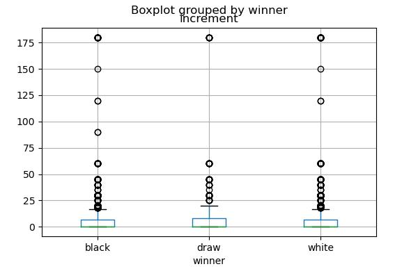
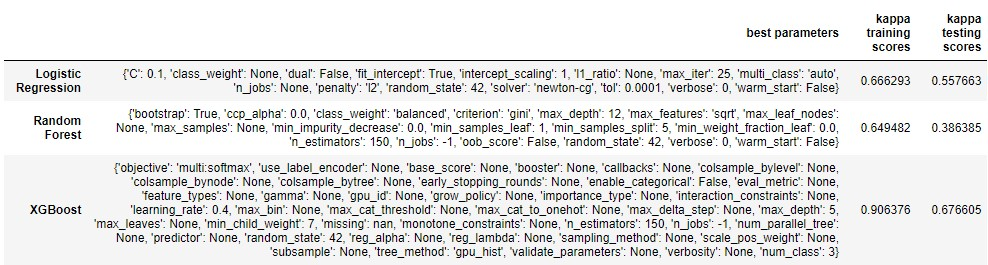
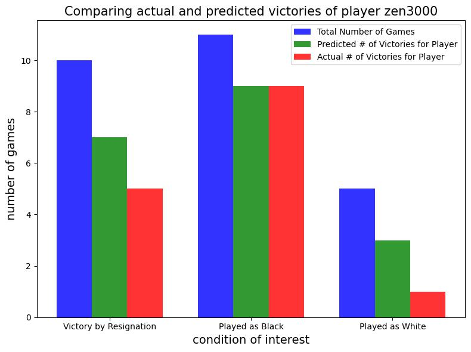

# Analyzing Chess Games to Improve Player Strategies

The game of chess has been around since the 6th century CE, and would eventually become one of the most commonly played board games. Now chess may be known more for being a solved game - in a sense - since artificial intelligence has the capability to beat the best players, but this has not stopped people from playing it competitively. Although highly advanced computer programs may be good at chess, there is still room for A.I. to come in and help players get better themselves. This is where projects like these come in, where datasets of tens of thousands of chess games are compiled and analyzed, to find better strategies for players, and improve their chances of victory.

## Data Wrangling

[Data Wrangling Notebook](https://github.com/RavinderRai/Chess_Data/blob/main/Data_Wrangling_on_the_Kaggle_Chess_Dataset.ipynb)

This project is analyzing the chess data set from Kaggle: https://www.kaggle.com/datasets/datasnaek/chess?select=games.csv. The ultimate aim of the project is to find strategies to improve the chances of victory for a player, whether they are playing as white or black. Luckily, this dataset had no null values. It did have a few features with a large amount of outliers, though in chess having some rare games that run longer than normal, or have many more turns than normal is not that uncommon. Thus, it made sense to keep these so no outliers were removed. 

The only faulty data here was that there were two features, one with values of the start times of the chess game, and one with end times. The column with end times data had a lot of values that were the same as the start time values, making games effectively last 0 seconds. This of course made no sense. A new feature that took the difference between these two features to get the total time of a game was made in place of these features, and the decision to keep or remove it would be left after some EDA was done.

## EDA

[Exploratory Data Analysis Notebook](https://github.com/RavinderRai/Chess_Data/blob/main/EDA_on_the_Kaggle_Chess_Dataset.ipynb)

Some of the first things done here was exploring some of the issues noticed in the Data Wrangling step, but this time with visual aids. A feature that had a lot of outliers can be seen below. This is the increment feature, which is a value that represents the amount of extra time each player is allotted every turn.

You can see here all the outliers. If it was just a few outliers, it may have been reasonable to simply remove those games, but with so many outliers it was deemed worth keeping the data. The same is true for a few other features as well. 

Another thing worth noting here was that the total time feature created before was dropped in the end. Also, perhaps the most important features in this dataset were long-form text values, so they were handled in the pre-processing step.

## Pre-Processing

[Pre-Processing Notebook](https://github.com/RavinderRai/Chess_Data/blob/main/Pre-Processing_and_Training_Data_Development.ipynb)

In this step, there were three text columns to handle. A count vectorizer function in Python was used to do this. The features were ones that described the moves of a game, as well as the opening moves. Aside from that, dummy variables were created for some categorical features, and all numeric features were standardized. Finally, the target variable, which was a category with values as white, black, or draw, describing the winner, was labeled.

## Modeling

[Modeling Notebook](https://github.com/RavinderRai/Chess_Data/blob/main/Modelling.ipynb)

In the modeling step many different models were tried, but mostly focusing on logistic regression, random forest, and XGBoost. With the help of grid search, the best model parameters for each model were obtained and compared in the end. That being said, the scoring metric was a bit non-traditional, in that the Cohen Kappa score was used here. Since this dataset is imbalanced (significantly fewer games ended in draws than white or black winning) with multiple labels, this scoring metric was a much better option than something like accuracy. The Cohen Kappa score measures how similar in agreement two raters are, where you can think of raters as people who are rating certain things, like movies. This can then be naturally used for classification problems, where one rater is the actual values of the target variable, and the other is the predicted values of the model. Thus, we can now report the Cohen Kappa scores for each of the best models.

## Applying the Model

[Model Utilization Notebook](https://github.com/RavinderRai/Chess_Data/blob/main/Final_Model_Review.ipynb)

To end this project, we can use the model on the test set to see how it might be useful in practice. Imagine a chess player came to you with only about 10 recorded chess games under his belt. That may not be enough data to gather any insights on his good or bad strategies, but the model was trained on over 20000 chess games, so it might do a better job. For example, there is a player with player ID zen3000. Below is a plot of some interesting insights.

From a plot like this, you can easily see that zen3000 should choose to play black when he can, as his odds of winning are much higher. When playing white, the raw data might suggest avoiding such a scenario, but the model seems to suggest otherwise, and perhaps some more practice is a better suggestion.

## Future Improvements and Revisions

There are many things you could do with chess data. Something that might be more interesting here would be to predict victory with the victory status as well, so if you wanted to play as white, and also win by having your opponent resign, what would be the best strategy? Other things might be to predict the next best move or predict the winner based on the board game state. 

Aside from other ideas, this project had a few limitations with computational power. Logistic regression was an algorithm that took a bit too long to train, so not a lot was done in grid search for it. XGBoost could make use of a GPU, so it was a bit faster, but it also has a lot more hyperparameters to choose from, so something to explore more would be to continue hyperparameter tuning to get an even better model. After all, while a Cohen Kappa score of 0.67 is good, something at least would be ideal.

## Credits

Thanks to Mitchell J for uploading the data onto Kaggle, and to Silvia Seceleanu for being an awesome Springboard mentor.
